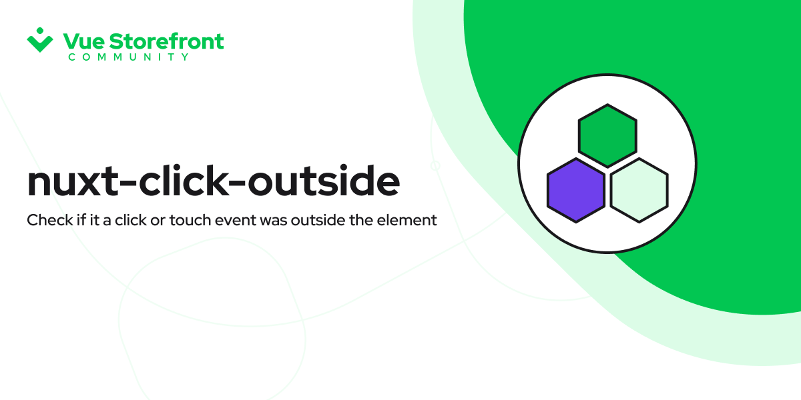

# @vuestorefront-community/nuxt-click-outside

[![npm version][npm-version-src]][npm-version-href]
[![npm downloads][npm-downloads-src]][npm-downloads-href]
[![Github Actions CI][github-actions-ci-src]][github-actions-ci-href]
[![License][license-src]][license-href]

> Check if it is a click or touch event was outside the element

- [✨ &nbsp;Release Notes]()
- [📖 &nbsp;Documentation]()
- [▶️ &nbsp;Online playground](https://codesandbox.io/s/github/vuestorefront-community/nuxt-click-outside)

## Features

- Check if element was clicked outside
- Validate for iFrames
- Middleware for event handlers
- Event handlers
- Function for capturing the events
- Select possible events type

[📖 &nbsp;Read more]()

## Contributing

You can contribute to this module online with CodeSandBox:

Or locally:

1. Clone this repository
2. Install dependencies using `yarn install` or `npm install`
3. Start development server using `yarn dev` or `npm run dev`

## License

[MIT License](./LICENSE)

Copyright (c) Nuxt Team

<!-- Badges -->
[npm-version-src]: https://img.shields.io/npm/v/@vuestorefront-community/nuxt-click-outside/latest.svg
[npm-version-href]: https://npmjs.com/package/@vuestorefront-community/nuxt-click-outside

[npm-downloads-src]: https://img.shields.io/npm/dm/@vuestorefront-community/nuxt-click-outside.svg
[npm-downloads-href]: https://npmjs.com/package/@vuestorefront-community/nuxt-click-outside

[github-actions-ci-src]: https://github.com/vuestorefront-community/nuxt-click-outside/workflows/ci/badge.svg
[github-actions-ci-href]: https://github.com/vuestorefront-community/nuxt-click-outside/actions?query=workflow%3Aci

[codecov-src]: https://img.shields.io/codecov/c/github/vuestorefront-community/nuxt-click-outside.svg
[codecov-href]: https://codecov.io/gh/vuestorefront-community/nuxt-click-outside

[license-src]: https://img.shields.io/npm/l/@vuestorefront-community/nuxt-click-outside.svg
[license-href]: https://npmjs.com/package/@vuestorefront-community/nuxt-click-outside